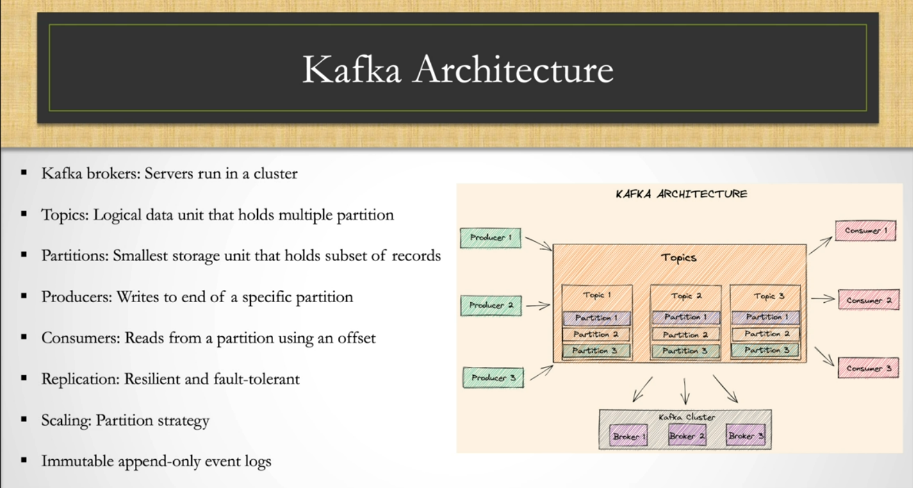
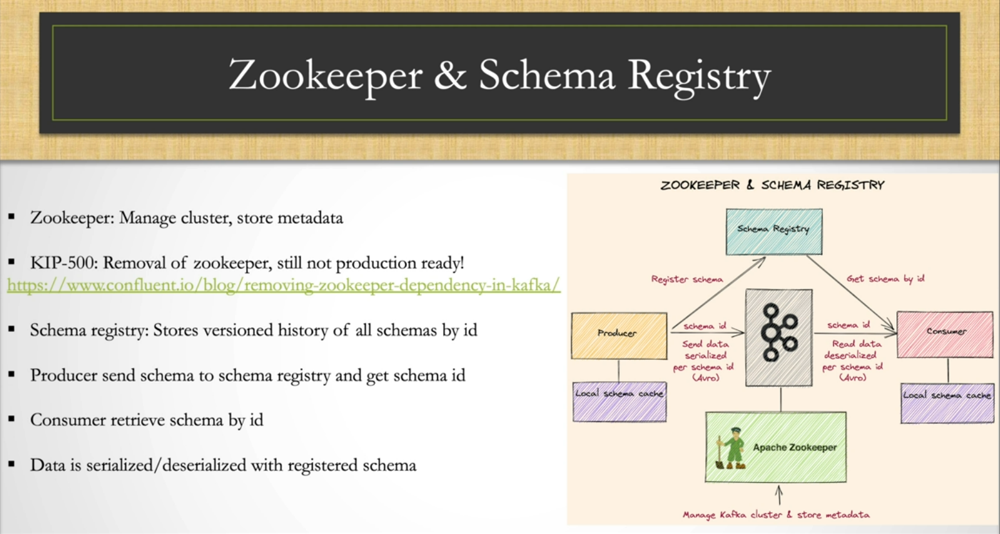

# Kafka

Архітектура Apache Kafka - це розподілена платформа для потокової обробки даних та обміну подіями в реальному часі. Вона призначена для зберігання та обробки великого обсягу даних, таких як логи, події, метрики, допомагаючи організувати потік даних між додатками та системами. Основним призначенням Kafka є створення надійних, масштабованих та витривалих систем обробки подій.

### Основні компоненти Kafka:

* Теми (Topics): Теми - це основний механізм організації даних у Kafka. Вони представляють потік повідомлень певної категорії. Додатки можуть писати дані в теми та читати дані з них.
* Брокери (Brokers): Брокери - це сервери, на яких запущений Kafka. Вони зберігають дані та обробляють запити від клієнтів. Брокери утворюють кластер Kafka.
* Зчитувачі та письменники (Producers and Consumers): Зчитувачі записують дані у теми, а письменники читають дані з тем. Вони можуть бути частинами різних додатків або систем, які обмінюються даними через Kafka.
* Споживачі груп (Consumer Groups): Споживачі можуть групуватись у споживачів групи, що дозволяє розділити обробку даних між багатьма споживачами. Кожен споживач групи отримує свою копію даних.
* Zookeeper: До певного часу Kafka використовував ZooKeeper для керування кластером та зберігання метаданих. Проте починаючи з певних версій, Kafka може працювати без ZooKeeper.
* Мережний шар (Network Layer): Відповідає за забезпечення комунікації між брокерами та клієнтами, передачу даних між темами та споживачами.
* Зберігання (Storage): Кафка зберігає дані у розподіленому та реплікованому (надійному) способі на брокерах.

Основна перевага Kafka - це можливість працювати з великими обсягами даних в реальному часі, надійність, масштабованість та 
можливість обробки подій у розподіленому середовищі. Вона знайшла широке застосування у сферах, де важлива потокова обробка даних, 
таких як аналітика в реальному часі, моніторинг, обробка логів, мікросервісна архітектура тощо.

* Обробка повідомлень
* Збирання даних
* Аналіз даних
* Відстеження подій
* Веб-аналітика

Kafka – це потужний інструмент для обробки потокових даних. Він використовується багатьма компаніями для різних цілей. Kafka – це відкрите програмне забезпечення, яке можна використовувати безкоштовно.
Ось деякі з переваг використання Kafka:
* Високий рівень масштабування
* Високий рівень надійності
* Високий рівень продуктивності
* Простота використання
* Відкрите програмне забезпечення

## Kafka brokers

Kafka брокери - це ключові компоненти в архітектурі Apache Kafka, які відіграють центральну роль у зберіганні та обробці потоків даних. Кожен брокер - це сервер, на якому працює Kafka, та він може бути частиною кластера брокерів. Відомо, що Kafka є розподіленою системою, і кластер брокерів дозволяє розділити завдання зберігання даних та обробки між кількома серверами.

### Основні пункти щодо Kafka брокерів:

1. **Зберігання даних**: Брокери зберігають дані, які надходять від виробників (продюсерів), в темах. Ці теми розділяються на різні партиції, які можуть розподілятися між різними брокерами у кластері.

2. **Обробка запитів**: Кожен брокер обробляє запити від клієнтів, які можуть бути виробниками (продюсерами) або споживачами. Вони можуть публікувати дані в теми або читати дані з тем. Брокери керують записами в партиціях та забезпечують доставку даних.

3. **Реплікація**: Брокери підтримують механізм реплікації даних для забезпечення надійності. Кожна партиція може мати кілька реплік, одна з яких є "лідером", який обробляє запити запису та читання, а інші репліки є "послідовниками", які слідкують за змінами лідера.

4. **Масштабованість**: Кластер брокерів може бути масштабованим горизонтально шляхом додавання нових брокерів. Це дозволяє збільшити потужність обробки та забезпечити високу доступність.

5. **Метадані**: Брокери також зберігають метадані про теми, партиції та споживачів у кластері. Це допомагає клієнтам знаходити потрібні дані та встановлювати з'єднання з відповідними брокерами.

6. **Відновлення після відмов**: Кластер брокерів може відновлюватися після відмови. Якщо один з брокерів відмовляє, інші брокери можуть взяти на себе завдання обробки даних та обслуговування клієнтів.

7. **Інструменти керування**: Існують інструменти для керування кластером брокерів, такі як інтерфейси командного рядка та графічні інтерфейси, які допомагають налаштувати, моніторити та керувати кластером.

Kafka брокери використовуються в різних сценаріях, де важлива обробка та зберігання великих обсягів даних в реальному часі. До прикладів використання можна віднести обробку логів, аналітику в реальному часі, споживання подій, моніторинг систем, потокову обробку даних для мікросервісної архітектури та багато іншого.

## Kafka Topics

Теми (Topics) в Apache Kafka - це механізм організації та зберігання потоків даних. Теми дозволяють групувати та категоризувати дані, що надходять в Kafka, і надають можливість споживачам (підписникам) зчитувати ці дані з тем для подальшої обробки.

### Основні пункти щодо Kafka тем:

1. **Організація даних**: Теми дозволяють розділяти дані на логічні категорії або теми. Наприклад, у вас може бути тема для логів додатка, окрема тема для метрик, і ще одна тема для подій користувачів.

2. **Розподілені партиції**: Кожна тема може бути розбита на одну або кілька партицій. Партиції дозволяють розділити дані на менші фрагменти, що можуть бути оброблені паралельно на різних брокерах.

3. **Запис та читання**: Виробники (продюсери) пишуть дані в теми, а споживачі (підписники) читають дані з тем. Це робить Kafka ідеальним для використання в системах, де дані мають бути оброблені в реальному часі.

4. **Зберігання даних**: Дані, які записуються в теми, зберігаються на брокерах Kafka. Таким чином, теми служать для тривалого зберігання та обробки даних.

5. **Реплікація**: Кожна партиція теми може мати кілька реплік на різних брокерах. Це забезпечує надійність та відновлення після відмов.

6. **Ключі повідомлень**: Кожне повідомлення в темі може мати ключ, що допомагає забезпечити збереженість повідомлень з однаковими ключами в одній партиції. Це важливо, коли дані повинні бути оброблені в тому ж порядку, в якому вони надійшли.

7. **Архівування та зберігання**: Теми можуть використовуватися для архівування даних на довготривалому зберіганні, що дозволяє зберегти дані на довше для подальшого аналізу або використання.

### Коли використовується Kafka теми:

1. **Обробка подій в реальному часі**: Kafka теми дозволяють системам обробляти події в реальному часі, такі як обробка логів, моніторинг, аналітика в реальному часі та інші сценарії, де важлива потокова обробка даних.

2. **Мікросервісна архітектура**: У мікросервісних архітектурах Kafka теми можуть використовуватися для обміну даними між різними мікросервісами.

3. **Машинне навчання та аналіз даних**: Дані з тем можуть бути використані для навчання моделей машинного навчання та аналізу для виявлення трендів та патернів.

4. **Логування та аудит**: Кafka теми можуть використовуватися для зберігання аудиторських даних та логів, що допомагає відстежувати дії користувачів та події в системі.

Взагалі, Kafka теми використовуються у будь-якому сценарії, де потрібно обмінюватися, зберігати та обробляти дані в реальному часі, або забезпечити відслідковування подій та забезпечити надійну та масштабовану інфраструктуру для цього.

## Kafka Partitions

Партиції (Partitions) - це ключовий механізм в архітектурі Apache Kafka, який дозволяє розділити теми на більші фрагменти для ефективної обробки та зберігання даних. Кожна тема може містити одну або більше партицій, і кожна партиція може бути розміщена на різних брокерах в кластері.

### Основні пункти щодо Kafka партицій:

1. **Розділення даних**: Партиції дозволяють розділити дані в темі на менші фрагменти, що можуть бути оброблені паралельно. Це підвищує масштабованість та швидкодію обробки даних.

2. **Розподіл на брокерах**: Кожна партиція може бути розміщена на різних брокерах у кластері. Це дозволяє рівномірно розподілити навантаження між брокерами та забезпечити високу доступність.

3. **Запис та читання**: Виробники (продюсери) записують дані в партиції тем, і споживачі (підписники) читають дані з партицій. Це дозволяє виробникам та споживачам працювати паралельно та незалежно один від одного.

4. **Збереження даних**: Кожна партиція має свій власний журнал (log), де зберігаються записи даних в тому порядку, в якому вони надійшли. Це дозволяє зберігати дані в темі на довгий термін.

5. **Реплікація**: Кожна партиція може мати кілька реплік на різних брокерах. Це забезпечує надійність та відновлення після відмов.

6. **Запис з ключами**: Кожен запис в партиції може мати ключ. Ключі допомагають забезпечити збереженість записів з однаковими ключами в одній партиції.

7. **Масштабованість**: Додавання нових брокерів до кластеру дозволяє розподілити партиції між більшою кількістю ресурсів та підвищити загальний обсяг обробки даних.

### Коли використовується Kafka партиції:

1. **Великі обсяги даних**: Коли потрібно обробляти та зберігати великі обсяги даних, розділення на партиції допомагає забезпечити ефективну обробку та збереження.

2. **Паралельна обробка**: Партиції дозволяють обробляти дані паралельно, що покращує продуктивність та швидкодію системи.

3. **Збереження подій в реальному часі**: У випадках, коли потрібно зберігати та обробляти події в реальному часі, партиції допомагають забезпечити надійну та ефективну систему.

4. **Масштабованість та висока доступність**: Використання партицій допомагає забезпечити масштабованість та високу доступність системи у кластері брокерів.

5. **Реплікація та відновлення після відмов**: Партиції разом із реплікацією допомагають забезпечити відновлення після відмов та збереженість даних.

Узагалі, використання партицій у Kafka дозволяє побудувати надійну, масштабовану та високопродуктивну систему обробки та збереження даних.

## Kafka Producer і Consumer

Kafka Producer і Consumer - це дві ключові складові системи Apache Kafka, які взаємодіють між собою для запису та читання даних у Kafka темах. Продюсери відповідають за публікацію даних у теми, а споживачі зчитують ці дані для подальшої обробки.

Основні пункти щодо Kafka Producer і Consumer:

**Kafka Producer (Виробник)**:

1. **Запис до тем**: Продюсери відповідають за запис даних у Kafka теми. Вони публікують повідомлення (дані) у теми для подальшої обробки та збереження.

2. **Вибір теми та партиції**: Продюсери можуть вибирати тему, у яку будуть писати дані, а також вказувати конкретну партицію, яку вони хочуть використовувати для запису.

3. **Надійність**: Продюсери можуть налаштовуватися для забезпечення надійності запису даних, використовуючи підтвердження (acks) від брокера про успішний запис.

4. **Батчі та затримки**: Продюсери можуть публікувати дані у батчах (групами), щоб зменшити накладні витрати на мережу та покращити продуктивність.

5. **Серіалізація**: Дані, передані виробником, можуть бути серіалізовані до певного формату (наприклад, JSON або Avro) перед надсиланням у Kafka.

**Kafka Consumer (Споживач)**:

1. **Читання з тем**: Споживачі відповідають за читання даних з Kafka тем. Вони підписуються на теми та отримують повідомлення для подальшої обробки.

2. **Вибір тем та партицій**: Споживачі можуть вибирати теми, на які вони хочуть підписатися, а також вказувати конкретні партиції, з яких вони хочуть читати дані.

3. **Поділ на споживачів групи**: Споживачі можуть об'єднуватися в споживачі групи, де кожна група отримує копії даних з різних партицій. Це дозволяє розподілити обробку даних між споживачами та забезпечити балансування навантаження.

4. **Надійність**: Споживачі можуть налаштовуватися для забезпечення надійного зчитування даних, використовуючи підтвердження (commit) про успішне зчитування.

5. **Паралельне зчитування**: Споживачі можуть зчитувати дані паралельно, що допомагає підвищити швидкодію та продуктивність обробки.

**Коли використовується Kafka Producer і Consumer**:

1. **Аналітика в реальному часі**: Використовуються для реалізації систем обробки подій в реальному часі, де дані виробляються та обробляються без затримок.

2. **Потокова обробка даних**: Використовуються для потокової обробки та аналізу даних, які надходять у реальному часі.

3. **Моніторинг та логування**: Застосовуються для збору логів та метрик, моніторингу стану системи та зчитування подій для аналізу.

4. **Мікросервісна архітектура**: Використовуються для обміну даними між мікросервісами у мікросервісних архітектурах.

5. **Аналіз даних та машинне навчання**: Можуть використовуватися для зчитування та обробки даних для аналізу, машинного навчання та створення моделей прогнозування.

Узагалі, Kafka Producer і Consumer використовуються в різних сценаріях, де потрібно забезпечити обмін, зберігання та обробку даних в реальному часі або для створення потокових обробних систем.

## Replication

Реплікація (Replication) у системі Apache Kafka - це механізм, який дозволяє створити копії даних (репліки) з однієї партиції на кількох брокерах. Цей процес забезпечує надійність, високу доступність та відновлюваність даних в системі, так як навіть при відмові одного брокера дані залишаються доступними на репліках і можуть бути відновлені.

### Основні пункти щодо Kafka реплікації:

1. **Надійність та відновлення**: Реплікація допомагає забезпечити надійність даних в системі. Якщо один з брокерів відмовляє, дані залишаються доступними на репліках. Це дозволяє відновити доступ до даних та продовжити їх обробку навіть після відмови.

2. **Реплікація лідера та послідовників**: У кожній партиції теми є одна репліка, яку називають "лідером", та додаткові репліки, які називають "послідовниками". Лідер обробляє всі записи та запити читання, а послідовники слідкують за змінами та реплікують дані з лідера.

3. **Відмовостійкість**: Якщо один з брокерів відмовляє, інші брокери можуть продовжувати обробку та реплікацію даних. Це дозволяє забезпечити відмовостійкість системи та уникнути втрати даних.

4. **Паралельна обробка**: Реплікація дозволяє паралельно обробляти дані на лідері та послідовниках. Це допомагає підвищити швидкодію та продуктивність системи.

5. **Переміщення лідерів**: Лідери партицій можуть автоматично переміщатися між брокерами для збалансування навантаження та забезпечення рівномірної обробки даних.

6. **Затримка реплікації**: Реплікація може бути налаштована з певною затримкою, що дозволяє відновити дані з попередніх моментів часу у разі потреби.

**Коли використовується Kafka реплікація**:

1. **Надійність даних**: Реплікація допомагає забезпечити надійність та відновлюваність даних в системі, що є критично важливим у сценаріях реального часу.

2. **Висока доступність**: Реплікація дозволяє забезпечити високу доступність системи навіть після відмов одного або кількох брокерів.

3. **Обробка великих обсягів даних**: У випадках, коли система обробляє великі обсяги даних, реплікація допомагає підвищити продуктивність та швидкодію обробки.

4. **Збереження логів та аудиту**: Реплікація допомагає забезпечити збереженість логі

в та аудиторських даних, навіть у разі відмов.

5. **Масштабованість та балансування навантаження**: Реплікація допомагає розподілити навантаження між різними брокерами та забезпечити балансування навантаження в кластері.

Загалом, реплікація є ключовим механізмом у Kafka, що допомагає забезпечити надійність, доступність та відновлюваність даних в потокових обробних системах.

## Scaling

Масштабування (Scaling) у системі Apache Kafka відіграє важливу роль у забезпеченні продуктивності, надійності та обробки великих обсягів даних. Масштабування Kafka означає збільшення ресурсів та здатності системи для впорядкування зростаючого обсягу даних.

### Основні пункти щодо Kafka масштабування:

1. **Вертикальне масштабування (Scale Up)**: Включає збільшення обсягу ресурсів (процесора, пам'яті, дискового простору) на окремому брокері. Це може покращити продуктивність системи, але має обмежену межу, оскільки висока ємність обмежується обладнанням.

2. **Горизонтальне масштабування (Scale Out)**: Включає додавання нових брокерів до кластеру, щоб розподілити навантаження між більшою кількістю ресурсів. Горизонтальне масштабування дозволяє досягти високої масштабованості та високої доступності.

3. **Динамічне масштабування**: Apache Kafka дозволяє додавати та видаляти брокери на льоту, що дозволяє адаптувати ресурси системи під змінні потреби.

4. **Масштабування продюсерів і споживачів**: Кожен продюсер та споживач може бути масштабованим, дозволяючи паралельно обробляти більше даних та забезпечити високу продуктивність.

5. **Масштабування партицій**: Додавання нових партицій до тем дозволяє розділити навантаження та розподілити обробку даних між більшою кількістю паралельних процесів.

**Коли використовується Kafka масштабування**:

1. **Великі обсяги даних**: Коли обсяги даних ростуть та системі потрібно обробляти та зберігати великі обсяги даних в реальному часі.

2. **Загрузочні піки**: В сценаріях, коли система має зустрічати часові піки навантаження (наприклад, під час рекламних кампаній або подій), масштабування допомагає забезпечити потрібну продуктивність.

3. **Мікросервісна архітектура**: У мікросервісних архітектурах, коли кількість сервісів росте, масштабування допомагає забезпечити обмін даними між різними компонентами.

4. **Потокова обробка даних**: В сценаріях потокової обробки даних, коли потрібно обробляти події в реальному часі, масштабування допомагає забезпечити ефективну обробку.

5. **Висока доступність та надійність**: Масштабування допомагає забезпечити високу доступність та надійність системи, що є важливим для багатьох застосунків.

Загалом, масштабування в системі Kafka є необхідним для забезпечення ефективної обробки, збереження та передачі великих обсягів даних в реальному часі.

## ZooKeeper

Apache ZooKeeper - це розподілена система управління конфігурацією, координації та керування, яка використовується як частина архітектури Apache Kafka для керування та координації брокерів та інших компонентів в кластері. ZooKeeper забезпечує надійну та послідовну роботу в умовах розподіленої системи.

### Основні пункти щодо Apache ZooKeeper у контексті Apache Kafka:

1. **Координація та обслуговування стану**: ZooKeeper допомагає у керуванні конфігурацією та станом всіх брокерів та інших компонентів у кластері Kafka. Він дозволяє визначати активних та недоступних брокерів, відслідковувати стан реплікації, керувати лідерами партицій тощо.

2. **Вибір лідерів партицій**: ZooKeeper допомагає визначити, який брокер є лідером для кожної партиції теми. Це важливо для забезпечення високої доступності та надійності в системі.

3. **Виявлення недоступних брокерів**: ZooKeeper слідкує за станом брокерів та виявляє недоступні брокери. Це допомагає розподілити навантаження між доступними брокерами та забезпечити відновлюваність після відмов.

4. **Керування конфігурацією**: ZooKeeper зберігає конфігураційні дані та метадані системи, що дозволяє брокерам та іншим компонентам отримувати оновлені дані про конфігурацію та зміни.

5. **Синхронізація та блокування**: ZooKeeper надає механізми синхронізації та блокування, які можуть використовуватися для забезпечення правильної послідовності подій у розподіленому середовищі.

**Коли використовується Apache ZooKeeper**:

1. **Apache Kafka**: ZooKeeper використовується в якості координаційної та керуючої системи для кластера Kafka. Він допомагає забезпечити надійність, відновлюваність та координацію роботи брокерів.

2. **Розподілені системи**: ZooKeeper може бути використаний у різних розподілених системах для керування та координації компонентів, збереження метаданих, блокування та синхронізації.

3. **Системи обробки подій в реальному часі**: У сценаріях обробки подій в реальному часі, де потрібно забезпечити надійну та координовану роботу компонентів, ZooKeeper може бути використаний для керування станом та обміном даними.

4. **Мікросервісна архітектура**: У мікросервісних архітектурах ZooKeeper може бути використаний для керування та координації між різними сервісами.

Загалом, Apache ZooKeeper є важливою складовою для забезпечення надійності, координації та управління розподіленою системою, такою як Apache Kafka.

## Schema Registry

Apache Kafka Schema Registry - це компонент, який використовується для управління та зберіганням схем даних в середовищі Apache Kafka. Він дозволяє централізовано керувати та верифікувати схеми даних, які використовуються у ваших повідомленнях, що передаються через Kafka. Schema Registry сприяє надійності, злагодженості та забезпечує сумісність при змінах структури даних.

### Основні пункти щодо Apache Kafka Schema Registry:

1. **Централізоване зберігання схем**: Schema Registry дозволяє зберігати схеми даних (наприклад, в форматі Apache Avro) в централізованому репозиторії. Це дозволяє всім продюсерам та споживачам даних отримувати доступ до актуальних схем.

2. **Верифікація схем**: Перед використанням схеми, продюсери та споживачі можуть перевірити схему на валідність та сумісність з існуючими схемами. Це допомагає уникнути невідповідностей та помилок у процесі обробки даних.

3. **Управління версіями схем**: Schema Registry дозволяє керувати різними версіями схем даних. Це важливо для забезпечення сумісності при внесенні змін до структури даних.

4. **Автоматична генерація схем**: Деякі інтегровані додатки та бібліотеки можуть автоматично генерувати схеми даних з ваших даних. Наприклад, Apache Avro може автоматично створювати схеми на основі даних.

5. **Сумісність і обмін даними**: Завдяки Schema Registry можливий обмін даними між різними додатками, мовами програмування та середовищами, оскільки схеми забезпечують стандартизацію структури даних.

6. **Підтримка різних форматів схем**: Schema Registry підтримує різні формати схем, такі як Apache Avro, JSON Schema тощо.

**Коли використовується Apache Kafka Schema Registry**:

1. **Потокова обробка даних**: В сценаріях, де використовується потокова обробка даних через Apache Kafka, Schema Registry допомагає забезпечити сумісність та верифікацію схем даних.

2. **Велика кількість додатків та споживачів**: У великих кластерах Kafka, де існує багато продюсерів та споживачів, Schema Registry допомагає керувати схемами та забезпечує їх актуальність.

3. **Системи з розподіленими командами**: У випадку, коли багато розробників та команд працює з однією системою, Schema Registry сприяє злагодженості та уникненню конфліктів в структурі даних.

4. **Забезпечення сумісності при змінах**: Schema Registry допомагає забезпечити сумісність між версіями додатків та компонентів при внесенні змін до схеми даних.

Загалом, Apache Kafka Schema Registry є важливим компонентом для забезпечення сумісності та верифікації схем даних в потокових обробних системах на базі Apache Kafka.

